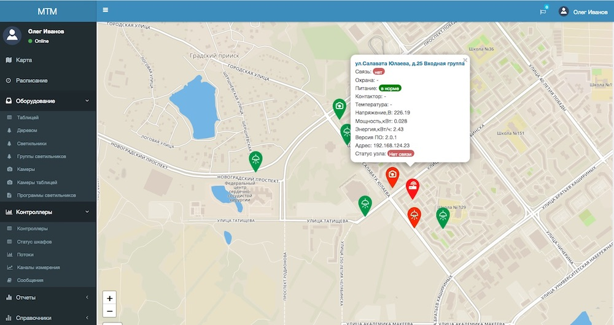
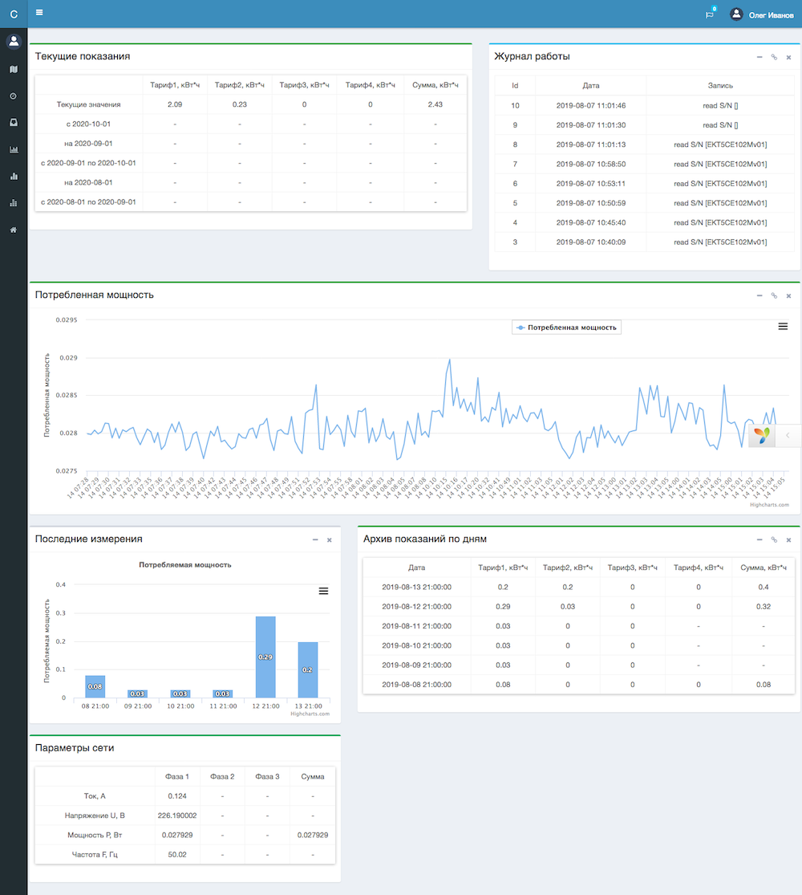
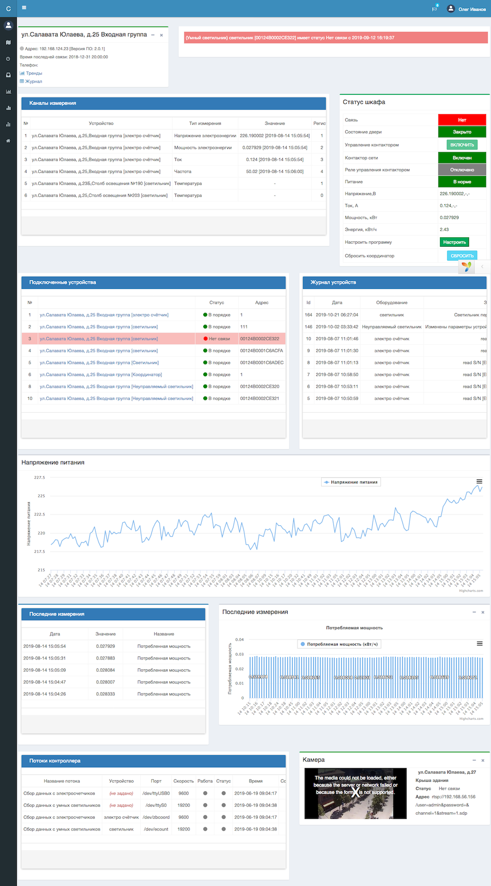

# mtm-server
Система управления светильниками и учета электроэнергии

Основная задача системы - управление светильниками через беспроводные модули связи и сбор данных по энергопотреблению как самих светильников, так и шкафов управления и вспомогательного оборудования в зависимости от режима работы. Дополнительная задача системы - сбор дополнительных данных с подключенных к модулям связи вспомогательных датчиков (влажности, температуры воздуха, сигнализации), передача звуковых сообщений и видео с камер наблюдения.

Многоуровневая система состоит уровня датчиков и светильников, которые подключаются к беспроводным модулям управления, которые в свою очередь связаны с контроллером ( escada2-core/Linux) через протокол Zigbee.

Контроллер является концентратором, который собирает данные и управляет одной или несколькими линиями светильников. Также к контроллеру подключаются:
-электросчетчик, которые учитывает расход электроэнергии на все подключенное оборудование, включая сами светильники;
-видеокамеры, которые устанавливаются на объекте учета;
-контакторы, которые позволяют управлять питанием всей линии. 

